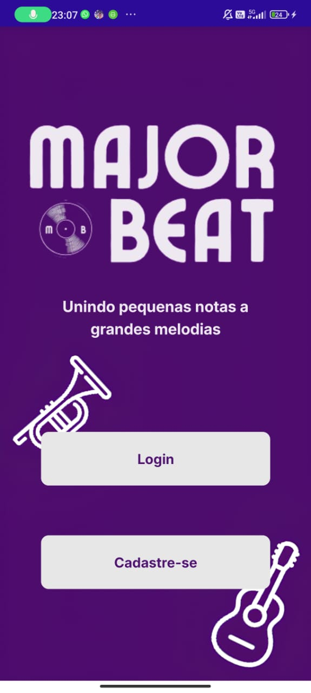
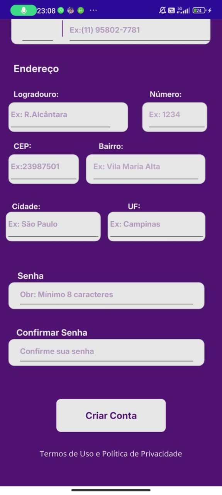

# Major-Beat_Login_Register
Repositório o qual está armazenado o Projeto Final do 2º Bimestre da Matéria de PAM2, realizado por Arthur Bonvecchio Batista e Eduardo Pereira de Queiroz

*API CRIADA POR EDUARDO QUEIROZ*
https://github.com/EduardoPQueiroz/API_MBProject.git

*APP MAUI CRIADO POR ARTHUR BATISTA*

TELAS CRIADAS 

- PÁGINA INICIAL
- CADASTRO DE CONTRATANTE

- **Página Inicial**  
  

- **Cadastro de Contratante**  
  

- **Confirmação de Cadastro**  
   

